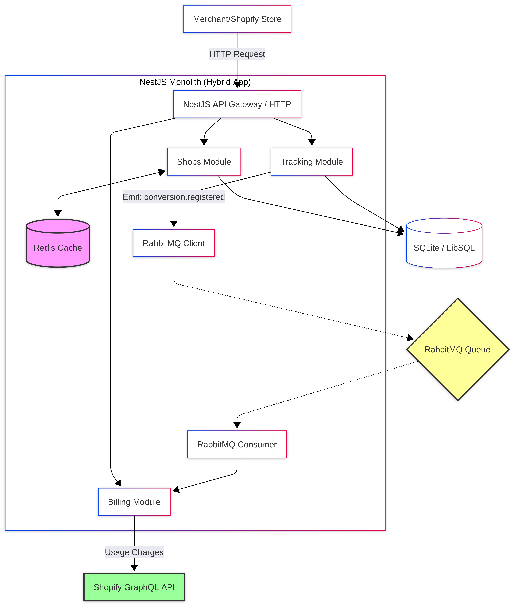

# Documentación del Proyecto: Shopify Affiliate Billing

Este documento detalla la instalación, arquitectura, estrategias de despliegue y decisiones técnicas tomadas para el sistema de seguimiento de afiliados y facturación de Shopify.

---

## 1. Instalación y Ejecución Local

### Prerrequisitos
*   Node.js (v18+)
*   Shopify CLI (para desarrollo de extensiones)
*   ngrok o Cloudflare Tunnel (para webhooks locales)

### Variables de Entorno (.env)

Crea un archivo `.env` en la carpeta `server/` basándote en `.env.example`:

```env
SHOPIFY_API_KEY=tu_api_key
SHOPIFY_API_SECRET=tu_api_secret
SHOPIFY_API_SCOPES=read_products,write_products
SHOPIFY_APP_URL=your_app_url_shopify
DATABASE_URL="file:./prisma/dev.db"
```

### Pasos Rápidos
1.  **Clonar el repositorio:**
    ```bash
    git clone <repository-url>
    cd test-converxity-shopify
    ```

2.  **Preparar la Base de Datos (SQLite):**
    *La base de datos se crea automáticamente al ejecutar las migraciones en el siguiente paso.*

3.  **Configurar y Levantar el Servidor (NestJS):**
    ```bash
    cd server
    cp .env.example .env # Configura tus credenciales de Shopify
    npm install
    npx prisma migrate dev
    npx prisma generate
    npm run start:dev
    ```

4.  **Configurar y Levantar el Frontend (React + Vite):**
    ```bash
    cd ../frontend
    npm install
    npm run dev
    ```

5.  **Desplegar Extensión (Web Pixel):**
    ```bash
    cd ..
    shopify app dev
    ```

---

## 2. Gestión de Entornos

### Ciclo de Vida (SDLC)
*   **Desarrollo (Local):** Uso de SQLite (LibSQL) para persistencia local rápida, `ngrok` para túneles y `shopify app dev` para vincular con una tienda de desarrollo.
*   **Staging:** Entorno idéntico a producción vinculado a una tienda de pruebas de Shopify para control de calidad.
*   **Producción:** Entorno de alta disponibilidad con monitoreo activo.

### Partner Dashboard
*   Se deben crear Apps separadas en el Partner Dashboard para Dev/Staging y Producción (o usar configuraciones de `shopify.app.toml` diferenciadas).
*   **Client ID/Secret** y **App URL** deben actualizarse por entorno para asegurar que los redireccionamientos de OAuth y los Webhooks lleguen al servidor correcto.

---

## 3. Pipelines de CI/CD (GitHub Actions)

Un flujo seguro incluiría:
1.  **Lint & Test:** Ejecución de ESLint y Jest/Vitest en cada PR.
2.  **Security Audit:** `npm audit` y escaneo de secretos (ej. TruffleHog).
3.  **Build Validation:** Verificación de que el servidor y frontend compilan correctamente.
4.  **Database Migration (Dry Run):** Verificar que las migraciones de Prisma son compatibles.
5.  **Deployment:** Despliegue automático a Staging tras merge a `develop`, y a Producción tras tag de release a `main`.

---

## 4. Estrategia de Despliegue

### Opciones de Infraestructura
*   **VPS (ej. DigitalOcean Droplet):** Despliegue de la app (Node.js) con una base de datos SQLite persistente (usando volúmenes de Docker si se desea contenedorizar la app) y Caddy/Nginx como Reverse Proxy.
*   **Cloud (ej. AWS/GCP):** Uso de contenedores para la app y **Turso** (LibSQL) o **RDS** (si se migra a Postgres/MySQL) para la base de datos administrada.
*   **Serverless (ej. Vercel/Render):** Frontend en Vercel, Backend en Render. Para SQLite en serverless, se recomienda **Turso** por su baja latencia y compatibilidad con LibSQL.

### Gestión de Secretos
*   Uso de variables de entorno (`.env`) nunca subidas al repo.
*   En producción, usar servicios como **AWS Secrets Manager** o **Doppler** para la rotación de claves de API y secretos de Shopify.

---

## 5. Arquitectura de Base de Datos

### Justificación del Esquema Actual
*   **SQLite (LibSQL):** Elegido por su simplicidad en desarrollo local, nula necesidad de configuración de infraestructura externa y excelente rendimiento para aplicaciones de Shopify de tamaño medio.
*   **Estructura Relacional:** Asegura integridad entre `Shop` -> `Affiliate` -> `Conversion`. Las claves foráneas y restricciones garantizan que no existan cobros huérfanos.

### Escalabilidad para Millones de Eventos
1.  **Migración a Base de Datos Distribuida:** Al escalar a millones de eventos, se recomienda migrar a **PostgreSQL** (con particionamiento) o seguir con **Turso/LibSQL** aprovechando sus réplicas de lectura cerca de los usuarios.
2.  **Índices Especializados:** Mantener índices B-Tree en `shopDomain` y `affiliateCode` para consultas rápidas.
3.  **Archivado de Eventos:** Implementar una estrategia de archivado para mover eventos antiguos de `PixelEvent` a un almacenamiento frío (S3/BigQuery) para mantener la base de datos principal ligera.

---

## 6. Decisiones de Arquitectura

### Estructura Hexagonal
*   Elegida para desacoplar la lógica de negocio (casos de uso) de los detalles de implementación (Shopify API, Prisma, NestJS). Esto facilita el testing y el cambio de proveedores de infraestructura.

### Asincronía e Idempotencia
*   **Procesamiento de Eventos:** Uso de colas (ej. BullMQ con Redis) para procesar webhooks y eventos del Pixel sin bloquear la respuesta HTTP.
*   **Idempotencia:** Cada evento tiene un `externalEventId` único. Antes de procesar una factura, se verifica si ya existe un `BillingRecord` asociado para evitar cobros duplicados en caso de reintentos de red.

### Alta Concurrencia
*   **Caché:** Uso de Redis para almacenar tokens de acceso de tiendas y configuraciones de afiliados frecuentes.
*   **Escalado Horizontal:** El servidor NestJS es stateless, permitiendo múltiples réplicas detrás de un Load Balancer.

---

## 7. DevOps y Monitoreo

*   **Health Checks:** Endpoint `/health` implementado en NestJS para que el orquestador (Docker/AWS) sepa cuándo reiniciar un contenedor.
*   **Monitoreo:** Integración con **Sentry** para errores y **Datadog/NewRelic** para métricas de rendimiento (Latencia de respuesta a Web Pixels es crítica).
*   **Rotación de Secretos:** Implementación de un script o pipeline que actualice periódicamente las claves de API sin tiempo de inactividad, aprovechando el soporte de múltiples claves de Shopify si es posible.

## 8. Escalabilidad Teórica (Alta Concurrencia)

Aunque construyas un MVP local con SQLite, queremos que tus decisiones arquitectónicas contemplen un escenario real de producción: la app instalada en más de 1,000 tiendas, procesando picos de miles de eventos y transacciones por minuto (ej. durante un Black Friday). 

La infraestructura actual está diseñada para desacoplar el registro de la conversión (HTTP) del procesamiento de cargos (Asíncrono vía RabbitMQ), permitiendo escalar el consumidor de billing de forma independiente según la carga.

## 9. Diagrama de arquitectura robusta



---

### Ejecución con Docker (Producción/Staging)

Para levantar el entorno completo (Redis, RabbitMQ) usando Docker Compose:

```bash
docker-compose build
docker-compose up -d
```


## 10. Aprobación y Fusión

> [!IMPORTANT]
> El jefe de IT o encargado del proyecto debe de aceptar el **Pull Request (PR)** de la rama feature/implement-scalar-system hacia `main` (Git Flow) para integrar oficialmente la caracteristica de arquitectura robusta con microservicios y escalabilidad.
